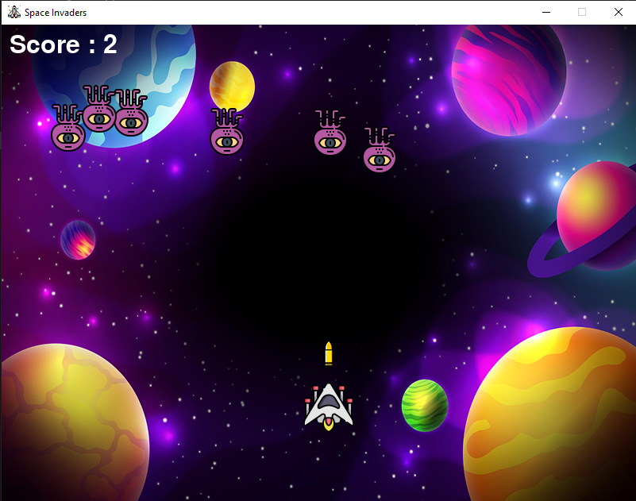

# Space Invader Game

This is a classic space invader game built using Python and Pygame. The game is designed to run on any platform that supports Python and Pygame.

## Installation

To install the game, follow these steps:

1. Clone the repository to your local machine.
2. Install Python 3.x on your machine.
3. Install Pygame by running `pip install pygame` in your terminal or command prompt.
4. Navigate to the cloned repository and run `python main.py` to start the game.

## Gameplay

The objective of the game is to shoot down all of the invading aliens before they collide with the player's spaceship. The player controls a spaceship at the bottom of the screen and can move left or right using the arrow keys. The player can shoot lasers at the aliens by pressing spacebar.

The aliens move back and forth across the screen, gradually moving closer to the player's spaceship with each pass. 
If an alien collides with the player's spaceship, it's game over.

## Contributing

If you'd like to contribute to this project, feel free to submit a pull request with your changes. Please make sure that any changes you make are thoroughly tested before submitting them.

## 

